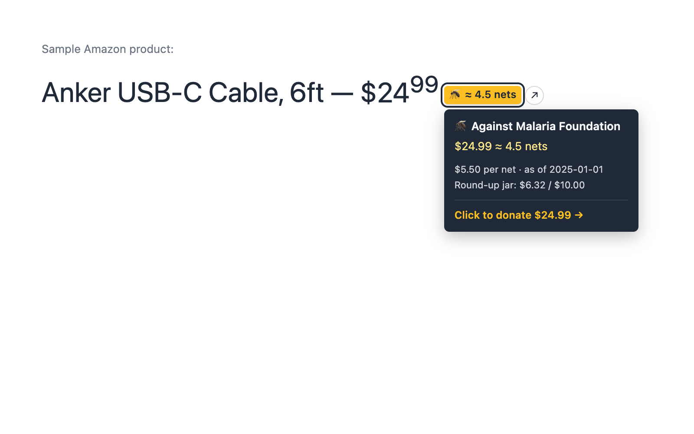
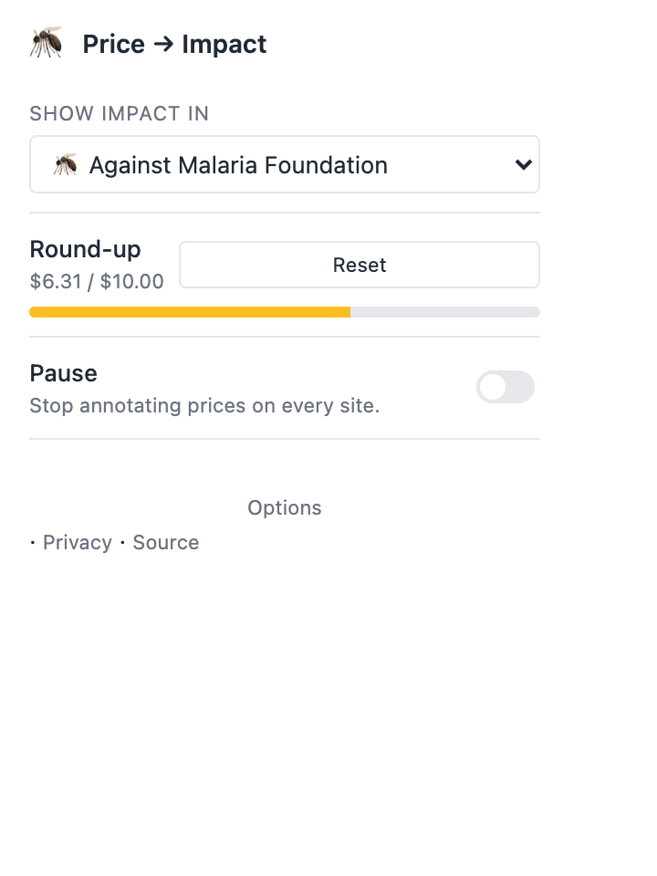
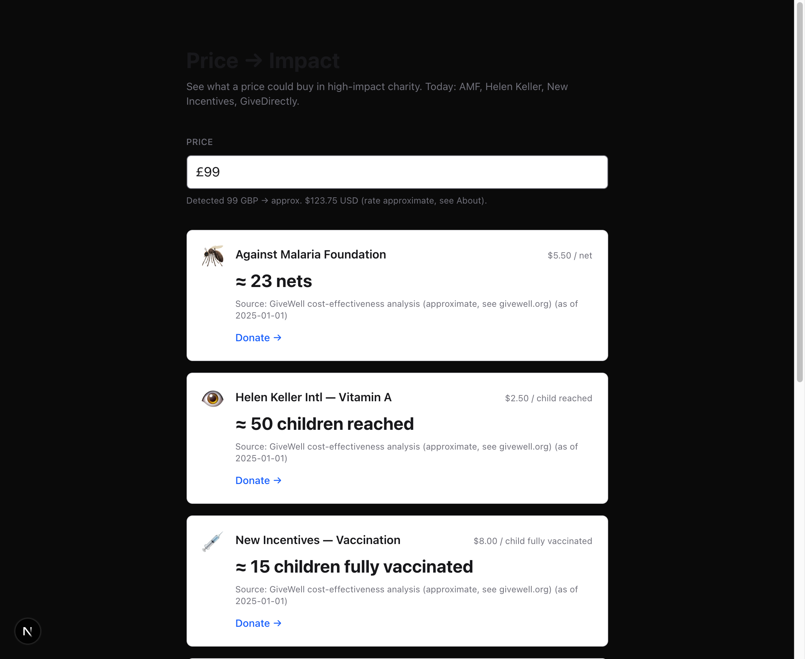
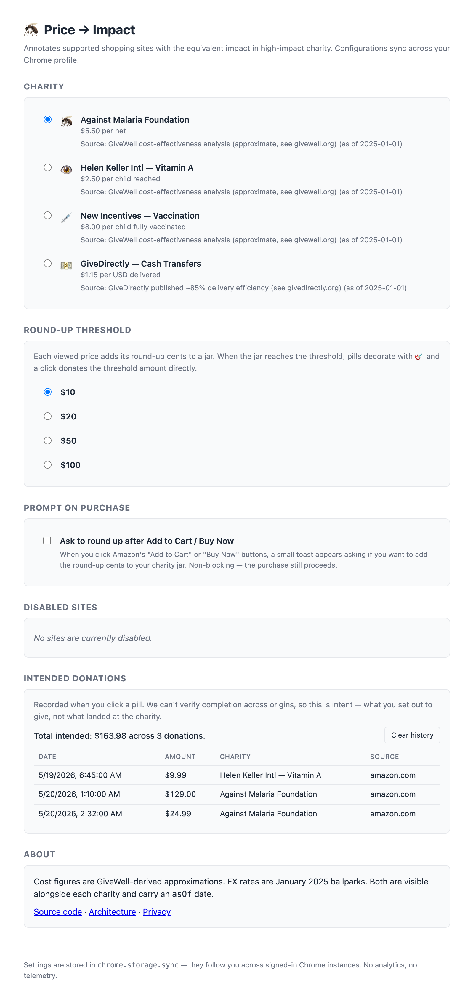

# Price → Impact

> Paste a price (any currency), see what it could buy in high-impact
> charity. Ships in three shells from one shared codebase: a web
> converter, a drag-to-bookmarks bookmarklet, and a Chrome MV3 extension.



The Chrome extension annotates Amazon prices with a small chip + a
hover card showing the charity, the math, the cost basis, and the
round-up jar status. Click to land on a 1-click donation page with the
amount already filled.

## Surfaces

<table>
<tr>
<td width="50%"><b>Extension popup</b><br/>charity dropdown, round-up jar progress, pause, per-site toggle</td>
<td width="50%"><b>Web converter</b><br/>paste any currency, see impact across all four charities</td>
</tr>
<tr>
<td></td>
<td></td>
</tr>
</table>

<details>
<summary><b>Options page</b> — full charity list, round-up threshold, history table, opt-in purchase prompt</summary>



</details>

## Status

| Phase | What | Where | State |
| --- | --- | --- | --- |
| 0 | Charity data + math + currency parser + static FX + round-up math | `packages/charities` | shipped |
| 1 | Web converter UI (any currency input, drag-link to bookmarklet) | `apps/web` | shipped |
| 2 | Bookmarklet (Amazon TLDs, MV3-safe IIFE, hover card) | `apps/bookmarklet` | shipped |
| 3 | Chrome MV3 extension (round-up jar, history, share, purchase prompt) | `apps/extension` | shipped |

CI runs lint, typecheck, test, and build on every push and PR.
**169 tests** across three workspaces.

Cost figures are GiveWell-derived approximations. FX rates are January
2025 ballparks. Both have `asOf` fields and `TODO(oliver)` markers for
a pre-launch verification pass.

## Repo layout

```
apps/
  web/          Next.js converter — paste a price, see all charities
  bookmarklet/  IIFE bundle → drag-to-bookmarks UX (builds into web/)
  extension/    Chrome MV3 manifest + content script
packages/
  charities/    Validated reference data: charities, FX rates,
                parsePriceString, convertPrice, formatUnits
docs/
  architecture.md  How the four workspaces talk to each other
  mv3-csp.md       Why we ship a single self-contained bundle
```

## Develop

Requires [Bun](https://bun.sh) 1.3+.

```sh
bun install
bun run dev          # boots apps/web on http://localhost:3000
bun run typecheck    # all workspaces
bun run lint         # all workspaces
bun run test         # all workspaces (Vitest)
bun run build        # apps/web (bookmarklet bundle regenerates first)
```

The bookmarklet bundle (`apps/web/src/generated/bookmarklet.ts`) is
gitignored and regenerated by the root `prebuild` / `predev` /
`pretypecheck` hooks.

### Building the extension

```sh
bun --filter '@price-to-impact/extension' run build
```

Then in Chrome: `chrome://extensions` → enable "Developer mode" →
"Load unpacked" → pick `apps/extension/dist/`.

## Where things live

| Task | File |
| --- | --- |
| Add a charity | `packages/charities/src/index.ts` |
| Add a currency | `packages/charities/src/parsePrice.ts` + `src/fx.ts` |
| Add a site detector | `apps/bookmarklet/src/detectors/<site>.ts` |
| Change pill style | `apps/bookmarklet/src/render.ts` |
| Tweak web UI | `apps/web/src/app/page.tsx` |
| Extension logic | `apps/extension/src/content.ts` |

See [`docs/architecture.md`](docs/architecture.md) for the full data
flow and the two contracts that hold it together.

---

<sub>A [Habitual Genesis](https://github.com/habitualgenesis) project.
Released under [MIT](LICENSE). Contributions welcome — see
[CONTRIBUTING](CONTRIBUTING.md).</sub>
